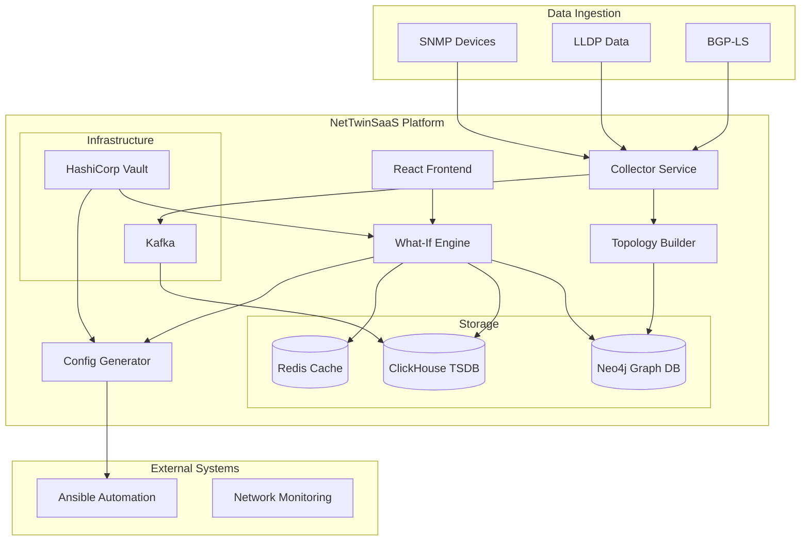

<<<<<<< HEAD
# NetTwinSaaS - Network Digital Twin as-a-Service

## Elevator Pitch

NetTwinSaaS es un gemelo digital de infraestructura de red que permite a operadores ISP y administradores de campus simular cambios en tiempo real sin impacto operacional. Descubre topología automáticamente, ejecuta simulaciones "qué pasaría si" y genera configuraciones seguras para despliegue, reduciendo tiempo de planificación de semanas a minutos.

## Arquitectura de Alto Nivel



## Instalación Local

### Requisitos
- Docker & Docker Compose
- Make (opcional)
- 8GB RAM mínimo
- Puertos disponibles: 3000, 8000-8004, 9000, 7474, 7687, 6379, 9092

### Inicio Rápido

```bash
# Clonar repositorio
git clone <repo-url>
cd nettwin-saas

# Copiar variables de entorno
cp .env.example .env

# Iniciar todos los servicios (< 3 minutos)
docker compose up --build

# O usando Make
make dev
```

### Servicios Disponibles

| Servicio | URL | Descripción |
|----------|-----|-------------|
| Frontend UI | http://localhost:3000 | Interfaz principal React |
| What-If Engine | http://localhost:8001 | API de simulaciones |
| Topology Builder | http://localhost:8002 | Servicio de descubrimiento |
| Config Generator | http://localhost:8003 | Generador de configuraciones |
| Collector | http://localhost:8004 | Colector de métricas |
| Neo4j Browser | http://localhost:7474 | Base de datos de grafos |

### Credenciales por Defecto

- **Aplicación**: demo/demo
- **Neo4j**: neo4j/password
- **ClickHouse**: default/(sin password)

## Demo del Flujo Completo

### 1. Descubrimiento Automático
```bash
# Iniciar descubrimiento de topología (datos sintéticos)
curl -X POST http://localhost:8002/api/v1/discover \
  -H "Authorization: Bearer demo-token" \
  -d '{"network_range": "192.168.1.0/24"}'
```

### 2. Simulación What-If
```bash
# Simular agregar enlace adicional
curl -X POST http://localhost:8001/api/v1/simulate \
  -H "Authorization: Bearer demo-token" \
  -H "Content-Type: application/json" \
  -d '{
    "action": "add_link",
    "src": "R1", 
    "dst": "R3",
    "capacity": 1000
  }'
```

### 3. Generar y Aplicar Configuraciones
```bash
# Generar configuraciones Ansible
curl -X POST http://localhost:8003/api/v1/generate \
  -H "Authorization: Bearer demo-token" \
  -d '{"simulation_id": "sim-001", "dry_run": true}'
```

## Testing

```bash
# Ejecutar tests unitarios
make test

# Coverage report
make coverage

# Linting
make lint
```

## Comandos Make Disponibles

```bash
make dev          # Iniciar entorno desarrollo
make test         # Ejecutar tests
make lint         # Linting código
make build        # Build imágenes Docker
make clean        # Limpiar containers
make logs         # Ver logs de servicios
```

## Estructura del Proyecto

```
├── services/
│   ├── collector/          # Colector métricas SNMP/LLDP
│   ├── topology-builder/   # Constructor topología
│   ├── what-if-engine/     # Motor simulaciones
│   ├── config-generator/   # Generador configuraciones
│   └── ui/                # Frontend React
├── postman/               # Colección API tests
├── .github/workflows/     # CI/CD GitHub Actions
└── docker-compose.yml     # Orquestación servicios
```

## API Documentation

Una vez iniciados los servicios:
- **What-If Engine**: http://localhost:8001/docs
- **Topology Builder**: http://localhost:8002/docs
- **Config Generator**: http://localhost:8003/docs

## Monitoreo y Logs

```bash
# Ver logs de todos los servicios
docker compose logs -f

# Ver logs de servicio específico
docker compose logs -f what-if-engine

# Métricas en tiempo real
docker stats
```

## Arquitectura de Seguridad

- JWT HS256 para autenticación
- Variables secretas en Vault (mock)
- CORS configurado para desarrollo local
- Rate limiting en APIs críticas

## Contribuir

1. Fork el repositorio
2. Crear feature branch (`git checkout -b feature/amazing-feature`)
3. Commit cambios (`git commit -m 'Add amazing feature'`)
4. Push branch (`git push origin feature/amazing-feature`)
5. Abrir Pull Request

## Licencia

MIT License - ver archivo LICENSE para detalles.
=======
# nettwinsaas
>>>>>>> 06862a65767734f6142acab5fcdbd7e9fd05b7d3
